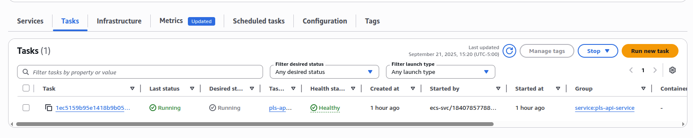
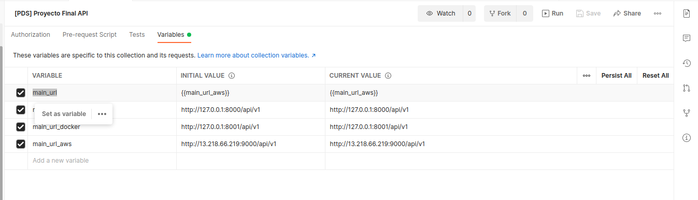
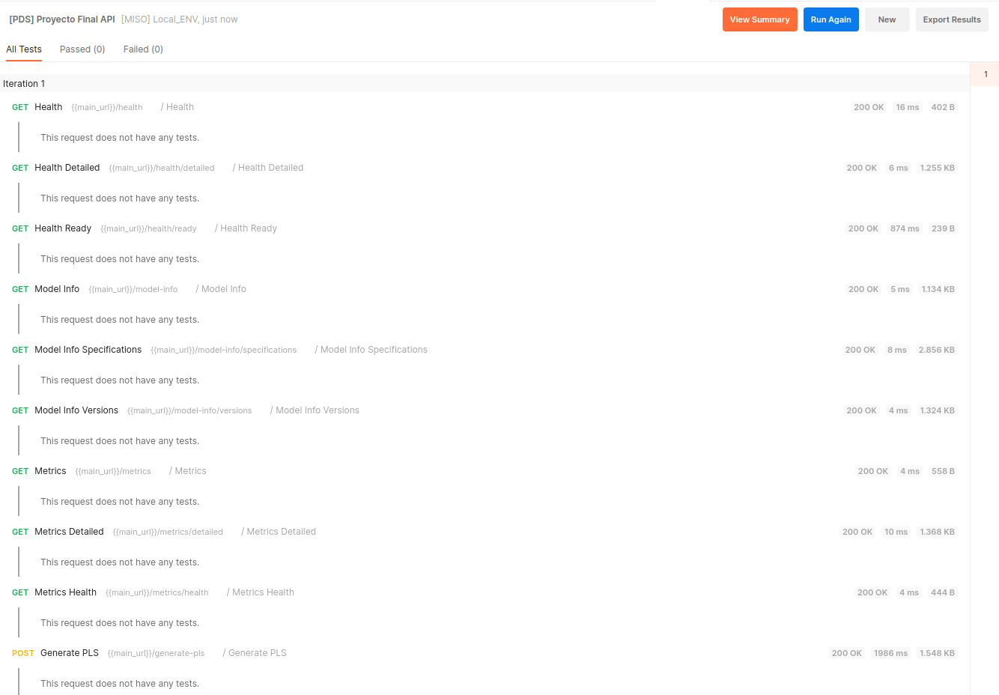
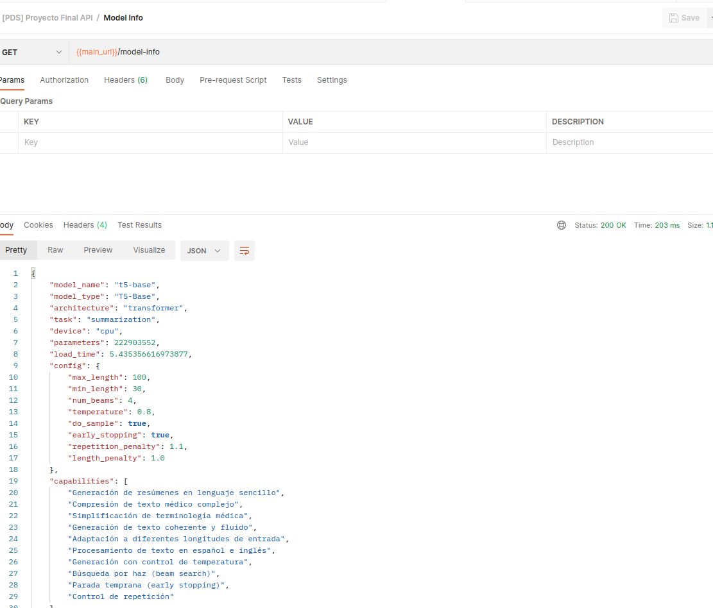

<div align="center">

# Univerdidad de los Andes
# Proyecto Desarrollo de Solucuiones
# Proyecto Final
# 🏥 Plain Language Summarizer (PLS)
# 2025

</div>

**Sistema de resumización médica en lenguaje sencillo para pacientes no expertos**

## Integrantes:

* Gabriela Munevar <l.munevarb@uniandes.edu.co>
* Erika Cardenas <en.cardenasc1@uniandes.edu.co>
* Carlos Chaparro Saenz <ca.chaparros1@uniandes.edu.co>
* Jean Marteen Munevar <j.munevarb@uniandes.edu.co>

---

## 🎯 Objetivo

El siguiente documento muestra como se despliega la solución **PLS** en un ambiente de Cloud en *AWS*. 

## Prerequisitos:

A continuación los prerequisitos que debe tener disponibles o instalados en su máquina para poder desplegar:

* Credenciales de acceso a AWS
* AWS CLI
* Terraform
* Docker
* Postman

## 🚀 Despliegue:

### 1. Aprovisionamiento de la infraestructura en AWS:

La solución **PLS** en AWS hace uso de los siguientes servicios:

1. Bucket S3 para almacenar los planes de despliegue de Terraform.
2. ECR para registrar las imagenes de los contenedores.
3. ECS para desplegar la solución en contenedores.

#### 1.1 Creación de Bucket S3:

Asegurese de haber configurado de forma correcta las credenciales de acceso a AWS en su AWS CLI.

Para verificar que esta correctamente conectado ejecute:

```bash
  aws sts get-caller-identity
```

La salida debe ser algo similar a:

```json
{
    "UserId": "AROAR4YFDEDOTUK3ADHPF:user4280107=Carlos_Alfonso_Chaparro_Saenz",
    "Account": "130470322397",
    "Arn": "arn:aws:sts::130470322397:assumed-role/voclabs/user4280107=Carlos_Alfonso_Chaparro_Saenz"
}
```

Ejecute el siguiente comando para crear el Bucket S3:

```bash
  aws s3api create-bucket --bucket terraform-pds-pls --region us-east-1 --debug
```

La salida debe ser algo similar a:

```json
{
    "Location": "/terraform-pds-pls"
}
```

#### 1.2 Creación del ECR:

Para crear el ECR donde se registrarán las imagenes que requerimos, ejecute los siguientes comandos:

```bash
# 1. Incializar el plan de ejecución
terraform -chdir=$(pwd)/terraform/stacks/container_registry init -backend-config=$(pwd)/terraform/environments/default/container_registry/backend.tfvars -reconfigure

# 2. Verificar el plan de ejecución
terraform -chdir=$(pwd)/terraform/stacks/container_registry validate

# 3. Crear el plan de ejecución
terraform -chdir=$(pwd)/terraform/stacks/container_registry plan -var-file=$(pwd)/terraform/environments/default/container_registry/terraform.tfvars -out=.tfplan

# 4. Ejecutar el plan
terraform -chdir=$(pwd)/terraform/stacks/container_registry apply .tfplan
```

Al finalizar la salida del comando será similar a:

```bash
repositories = {
  "repository_arn" = {
    "pls-api" = "arn:aws:ecr:us-east-1:<ECR_ACCOUNT_ID>:repository/pls-api"
    "pls-api-base" = "arn:aws:ecr:us-east-1:<ECR_ACCOUNT_ID>:repository/pls-api-base"
  }
  "repository_name" = {
    "pls-api" = "pls-api"
    "pls-api-base" = "pls-api-base"
  }
}
```

Copie el valor **<ECR_ACCOUNT_ID>**, ya que lo usaremos más adelante.

### 2. Creando y subiendo las imagenes a ECR:

#### 2.1 Creando las imagenes:

Ejecute el siguiente comando que crea la imagen base de la solución:

```bash
  docker build -t pls-api-base -f Dockerfile.base .
```

**NOTA**: Este proceso puede tomar varios minutos.

Ahora ejecute el siguiente comando que crea la imagen de la solución:

```bash
  docker build -t pls-api:latest .
```

#### 2.2 Conectando docker con ECR:

Para poder subir las imagenes a ECR, debe conectar su docker local con ECR. Para esto, ejecute el siguiente comando. **NO** olvide reemplazar el valor de **<ECR_ACCOUNT_ID>** en el comando a ejecutar, con el copiado en el paso 1.2.

```bash
  aws ecr get-login-password --region us-east-1 | docker login --username AWS --password-stdin <ECR_ACCOUNT_ID>.dkr.ecr.us-east-1.amazonaws.com
```

Por ejemplo:

```bash
  aws ecr get-login-password --region us-east-1 | docker login --username AWS --password-stdin 130470322397.dkr.ecr.us-east-1.amazonaws.com
```

La salida de este comando debe ser similar a:

```
Login Succeeded
```

####2.3 Subiendo las imagenes a ECR:

Ejecute los siguientes comandos:

**IMPORTANTE**: No olvide reemplazar el valor de **<ECR_ACCOUNT_ID>** en los comandos a ejecutar, con el copiado en el paso 1.2.

**NOTA**: Este proceso puede tomar varios minutos.

```bash
#1. Crear los TAGS
docker tag pls-api-base:latest <ECR_ACCOUNT_ID>.dkr.ecr.us-east-1.amazonaws.com/pls-api-base:1.0.0
docker tag pls-api:latest <ECR_ACCOUNT_ID>.dkr.ecr.us-east-1.amazonaws.com/pls-api:1.0.0

#2. Subir las imagenes a ECR
docker push <ECR_ACCOUNT_ID>.dkr.ecr.us-east-1.amazonaws.com/pls-api-base:1.0.0
docker push <ECR_ACCOUNT_ID>.dkr.ecr.us-east-1.amazonaws.com/pls-api:1.0.0
```

Por ejemplo:

```bash
docker tag pls-api-base:latest 130470322397.dkr.ecr.us-east-1.amazonaws.com/pls-api-base:1.0.0
docker tag pls-api:latest 130470322397.dkr.ecr.us-east-1.amazonaws.com/pls-api:1.0.0

docker push 130470322397.dkr.ecr.us-east-1.amazonaws.com/pls-api-base:1.0.0 
docker push 130470322397.dkr.ecr.us-east-1.amazonaws.com/pls-api:1.0.0
```

### 3. Creación del ECS:

Para crear el ECS donde se desplegará la aplicación, ejecute los siguientes comandos:

```bash
# 1. Incializar el plan de ejecución
terraform -chdir=$(pwd)/terraform/stacks/ecs init -backend-config=$(pwd)/terraform/environments/default/ecs/backend.tfvars -reconfigure

# 2. Verificar el plan de ejecución
terraform -chdir=$(pwd)/terraform/stacks/ecs validate

# 3. Crear el plan de ejecución
terraform -chdir=$(pwd)/terraform/stacks/ecs plan -var-file=$(pwd)/terraform/environments/default/ecs/terraform.tfvars -out=.tfplan

# 4. Ejecutar el plan
terraform -chdir=$(pwd)/terraform/stacks/ecs apply .tfplan
```

Al finalizar la salida del comando será similar a:

```
Outputs:

alb_dns_name = "pls-api-alb-1766951210.us-east-1.elb.amazonaws.com"
alb_zone_id = "Z35SXDOTRQ7X7K"
ecs_cluster_name = "pds-pls-cluster"
ecs_service_name = "pls-api-service"
service_url = "http://pls-api-alb-1766951210.us-east-1.elb.amazonaws.com"
target_group_arn = "arn:aws:elasticloadbalancing:us-east-1:130470322397:targetgroup/pls-api-tg/38efdea8964f5ce6"
task_definition_arn = "arn:aws:ecs:us-east-1:130470322397:task-definition/pls-api-task:3"
```

Copie el campo **service_url** ya que lo usaremos en el siguiente paso.

### 4. Pruebas y verificaciones:

#### 4.1 API:

**IMPORTANTE**: Antes de iniciar a ejecutar las pruebas y verificaciones, espere unos minutos mientras se aprovisionan los contenedores en ECS, ya que esto puede tomar algunos minutos.

Para comprobar esto, ingrese a la consola de AWS, ECS, pestaña Tasks y verifique el estado de las tareas (el Health status debe verse Running):



1. Abra la colección de Postman que se encuentra en *test/[PDS]_Proyecto_Final_API.postman_collection.json*.
2. De clic sobre el nombre de la colección y en la sección Variables, cambie el valor de la variable *main_url* por el valor *service_url* copiado en la sección 3, como se puede ver en la siguiente imagen 




3. Ejecute uno a uno los request disponibles en la colección:



4. Verifique los resultados obtenidos:



#### 4.2 Tablero:

PENDIENTE.

### 5. Borrar el ambiente de AWS:

Para borrar los recursos creados en AWS, ejecute los siguientes comandos:

```bash
# 1. Borrar ECS
terraform -chdir=$(pwd)/terraform/stacks/ecs destroy -var-file=$(pwd)/terraform/environments/default/ecs/terraform.tfvars

# 2. Borrar ECR
terraform -chdir=$(pwd)/terraform/stacks/container_registry destroy -var-file=$(pwd)/terraform/environments/default/container_registry/terraform.tfvars

# 3. Borrar el Bucket S3
aws s3api create-bucket --bucket terraform-dann-ingcarloschaparro --region us-east-1 --debug

aws s3api list-objects --bucket terraform-pds-pls --query 'Contents[].Key' --output text | xargs -n 1 
aws s3api delete-object --bucket terraform-pds-pls --key

aws s3api delete-bucket --bucket terraform-pds-pls

```

