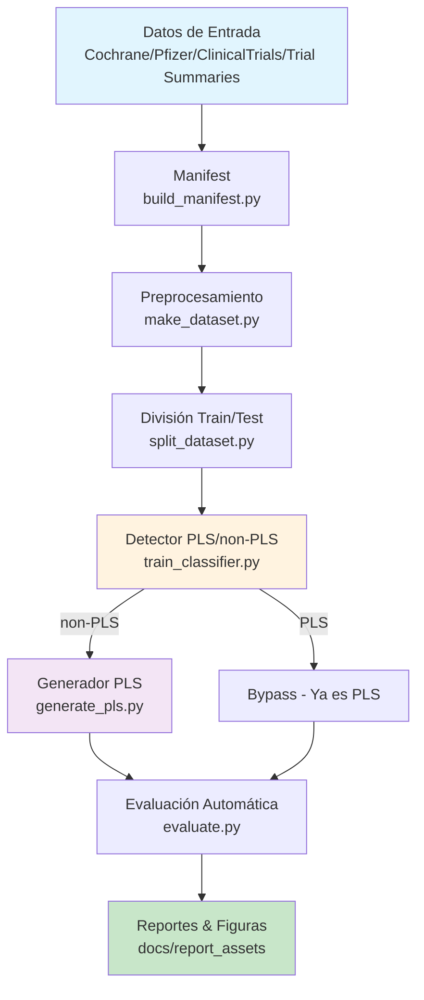

# Prototipo del Sistema de Generación de PLS

## Descripción General
Este documento describe la maqueta y el flujo del prototipo del sistema de generación de resúmenes en lenguaje sencillo (Plain Language Summaries, PLS) para textos biomédicos complejos.

## Contexto del Problema

### Alfabetización en Salud
La alfabetización en salud se refiere a la capacidad de una persona para acceder, comprender y utilizar información relacionada con su bienestar. Esta habilidad es esencial para que pacientes y sus familias puedan:
- Acceder a los sistemas de atención médica
- Seguir tratamientos correctamente
- Tomar decisiones informadas sobre su salud

**Problema identificado**: Casi la mitad de la población mundial presenta alfabetización en salud insuficiente, especialmente:
- Adultos mayores
- Personas con bajos ingresos
- Personas con menor nivel educativo

**Consecuencias**:
- Mayores tasas de hospitalización prevenible
- Menor adherencia a tratamientos
- Incremento en la desigualdad en salud pública

### Solución Propuesta
Los resúmenes en lenguaje sencillo (PLS) traducen textos biomédicos complejos en información clara y accesible. Sin embargo, su producción manual es:
- Lenta y costosa
- Poco escalable
- Especialmente difícil en áreas con alta densidad terminológica

## Pregunta de Negocio
**¿Cómo podemos automatizar la conversión de textos biomédicos complejos en resúmenes en lenguaje sencillo para garantizar que los pacientes comprendan la información y puedan tomar decisiones informadas?**

## Arquitectura del Sistema

### Componentes Principales
El sistema está compuesto por dos elementos principales:

1. **Clasificador Binario**: Determina si un texto está escrito en lenguaje técnico o en lenguaje sencillo
   - Utiliza embeddings contextuales y dispersos
   - Identifica textos que ya son PLS vs. textos que requieren simplificación

2. **Modelos Generativos**: Transforman textos biomédicos complejos en resúmenes claros
   - Arquitectura tipo decoder
   - Estrategias de fine-tuning parcial y completo
   - Enfoque en modelos abiertos de menor tamaño vs. modelos comerciales

## Diagrama de Flujo del Sistema



## Pipeline de Datos (DVC)

### Etapas del Pipeline

| Etapa | Script | Entradas | Salidas (DVC) | Evidencia |
|-------|--------|----------|---------------|-----------|
| **manifest** | `src/data/build_manifest.py` | `data/raw/**/*` | `data/processed/raw_manifest.csv` | Conteos por extensión/fuente |
| **preprocess** | `src/data/make_dataset.py` | raw + heurísticas | `data/processed/dataset_clean_v1.(jsonl,csv)` | % con PLS, labels por fuente, dedup |
| **split** | `src/data/split_dataset.py` | `dataset_clean_v1.csv` | `data/processed/train.csv, test.csv` | Tabla por source_dataset × split × label |
| **train** | `src/models/train_classifier.py` | `train.csv` | `models/*` | F1 macro, matriz de confusión |
| **generate** | `src/models/generate_pls.py` | `test.csv, models/*` | `data/outputs/pred.jsonl` | Ejemplos de PLS generados |
| **evaluate** | `src/models/evaluate.py` | `pred.jsonl, test.csv` | `data/evaluation/*` | ROUGE/BERTScore, legibilidad, compresión |

### Comandos de Ejecución
```bash
# Ejecutar pipeline completo
dvc repro manifest
dvc repro preprocess
dvc repro split
dvc repro train
dvc repro generate
dvc repro evaluate

# Verificar estado
dvc status -c
dvc push
```

## Componentes del Sistema

### 1. Preprocesamiento de Datos (`src/data/make_dataset.py`)

**Funcionalidades**:
- Procesa múltiples formatos: TXT, CSV, JSON, JSONL
- Omite archivos PDF
- Infere metadatos desde la ruta del archivo
- Maneja diferentes estructuras de datos:
  - Pares "TEXTO ||| PLS" → `has_pair = True`
  - PLS sueltos (carpetas 'pls/') → `resumen = texto, texto_original = ""`
  - Non-PLS sueltos (carpetas 'non_pls/') → `texto_original = texto, resumen = ""`

**Heurísticas de columnas**:
- **Texto**: `texto`, `text`, `source`, `article`, `document`, `original`, `input`, `content`, `body`
- **PLS**: `resumen`, `summary`, `pls`, `simple`, `plain_language`, `simplified`, `plain_language_summary`

**Filtros de calidad**:
- Longitud mínima: 30 caracteres
- Longitud máxima: 20,000 caracteres
- Deduplicación por hash de (texto_original || resumen)

### 2. División de Datos (`src/data/split_dataset.py`)

**Estrategia de división**:
- Respeta splits originales si existen (`split_method='original'`)
- Para datos sin split: división 80/20 reproducible
- Estratificación por label cuando es posible
- Marcado de método de división (`split_method='internal'`)

### 3. Clasificador PLS vs non-PLS (`src/models/train_classifier.py`)

**Objetivo**: Clasificar si un texto ya está en lenguaje sencillo

**Datos de entrenamiento**:
- **Positivos**: ejemplos con `label=pls` o `len_pls>0`
- **Negativos**: `label=non_pls` y `len_pls==0`

**Estrategias**:
- **Baseline rápido**: TF-IDF (1-2-gramas) → LogReg o Linear SVM
- **Alternativa contextual**: DistilBERT/BERT fine-tuning (si hay GPU)

**Métricas**: Accuracy, F1 macro, matriz de confusión por fuente

### 4. Generador de PLS (`src/models/generate_pls.py`)

**Enfoque principal**: Modelos encoder-decoder para resumen abstractivo

**Modelos candidatos**:
- BART / BART-large-cnn (robusto en resumen genérico)
- T5 (base/large) o LongT5 (para textos largos)
- LED (Longformer Encoder-Decoder) para contextos >4k tokens
- Variantes biomédicas: BioBART, BioT5 (si están disponibles)

**Preparación del corpus**:
- Usar filas con `has_pair=True`
- Matching adicional por ID (ej. NCT) para aumentar pares
- Chunking del texto original (1024-2048 tokens)
- Target: 120-250 palabras

**Estrategias de fine-tuning**:
- **SFT Full**: `lr=3e-5`, `epochs=3-5`, `batch_global≈64`
- **PEFT/LoRA/QLoRA**: Para recursos limitados, adapta solo capas de atención

**Instrucciones de generación**:
```
"Explica resultados, población, intervención y desenlaces con lenguaje cotidiano. 
Evita copiar frases textuales; no inventes datos."
```

### 5. Evaluación (`src/models/evaluate.py`)

**Métricas automáticas** (cuando hay ground truth):
- **ROUGE-L, BERTScore (F1)**
- **Compresión**: medianas de `wc_ratio_pls_src` y `len_ratio_pls_src`
- **Legibilidad**: Flesch Reading Ease (PLS > original, Δ ≥ +15)
- **Calidad formal**: % frases muy largas, % mayúsculas, % símbolos

**Evaluación sin ground truth**:
- Legibilidad, compresión y chequeos heurísticos
- Relevancia por QA (opcional)

## Conjunto de Datos

**Fuente**: Corpus recopilado en la investigación "Bridging the Gap in Health Literacy: Harnessing the Power of Large Language Models to Generate Plain Language Summaries from Biomedical Texts"

**Repositorio**: https://github.com/feliperussi/bridging-the-gap-in-health-literacy/tree/main/data_collection_and_processing/Data%20Sources

**Estructura esperada**:
- **Cochrane**: Resúmenes sistemáticos
- **Pfizer**: Documentos regulatorios
- **ClinicalTrials.gov**: Registros de ensayos clínicos
- **Trial Summaries**: Resúmenes de ensayos

## Criterios de Éxito (v1)

| Dimensión | Métrica | Umbral Inicial |
|-----------|---------|----------------|
| **Detección PLS** | F1 macro (test) | ≥ 0.80 |
| **Compresión** | Mediana wc_ratio_pls_src | 0.30–0.50 |
| **Legibilidad** | Flesch (PLS) – Flesch (orig.) | ≥ +15 |
| **Fidelidad** | BERTScore F1 (pares) | ≥ 0.80 |
| **Reproducibilidad** | `dvc status -c` | Sin cambios |

## Plan de Trabajo

### Fase 1: Preparación de Datos
- [x] Estructura del pipeline DVC
- [x] Scripts de preprocesamiento
- [x] División train/test
- [ ] Matching por NCT para aumentar `has_pair=True`

### Fase 2: Clasificador
- [ ] Baseline TF-IDF + LogReg
- [ ] Métricas por fuente
- [ ] Alternativa: DistilBERT fine-tuning (si hay GPU)

### Fase 3: Generador
- [ ] BART/T5 fine-tuning (LoRA si VRAM limitada)
- [ ] Chunking del input
- [ ] Longitud objetivo 120-250 palabras
- [ ] Guardar `pred.jsonl` con metadatos

### Fase 4: Evaluación
- [ ] ROUGE/BERTScore para pares
- [ ] Legibilidad y compresión para todos
- [ ] Exportar figuras/tablas a `docs/report_assets/`

## Riesgos y Mitigaciones

| Riesgo | Impacto | Mitigación |
|--------|---------|------------|
| Pocos pares texto-PLS | Evaluación supervisada limitada | Matching por ID (NCT), heurísticas por título/fuente |
| Desbalance de clases | Sesgo del detector | Class weights, undersampling/oversampling, estratificación |
| Textos muy largos | Truncamiento | Chunking + resumen jerárquico (map-reduce) |
| "PLS" más largo que el original | Ruido/etiquetado | Reglas de filtrado por ratio y legibilidad |
| Variación de estilo por fuente | Variabilidad en métricas | Reportes estratificados por source_dataset |

## Estructura de Directorios

```
pds-proyecto-final/
├── data/
│   ├── raw/           # Datos originales
│   ├── processed/     # Datos procesados
│   ├── outputs/       # PLS generados
│   └── evaluation/    # Resultados de evaluación
├── src/
│   ├── data/          # Scripts de procesamiento
│   ├── models/        # Modelos y entrenamiento
│   └── utils/         # Utilidades
├── models/             # Modelos entrenados
├── docs/               # Documentación y reportes
├── notebooks/          # Jupyter notebooks
├── dvc.yaml           # Pipeline DVC
└── params.yaml        # Parámetros de configuración
```

## Alcance del Proyecto

### Incluido
- Revisión de literatura sobre alfabetización en salud
- Implementación de clasificador para identificar nivel de tecnicismo
- Entrenamiento de modelos generativos tipo decoder
- Evaluación comparativa entre modelos pequeños y comerciales
- Análisis mediante métricas de relevancia, factualidad y legibilidad
- Visualización de resultados comparativos

### No Incluido
- Creación de nuevos datasets
- Traducción multilingüe
- Interfaces de usuario
- Despliegue en producción
- Arquitecturas de gran escala (limitado por recursos computacionales)

## Beneficios Esperados

1. **Facilitar acceso** de pacientes y familiares a información médica clara
2. **Reducir brecha** de alfabetización en salud
3. **Generar marco metodológico** replicable para PLN en salud
4. **Automatizar** la generación y evaluación de PLS de manera objetiva
5. **Contribuir** a la toma de decisiones informadas en salud
