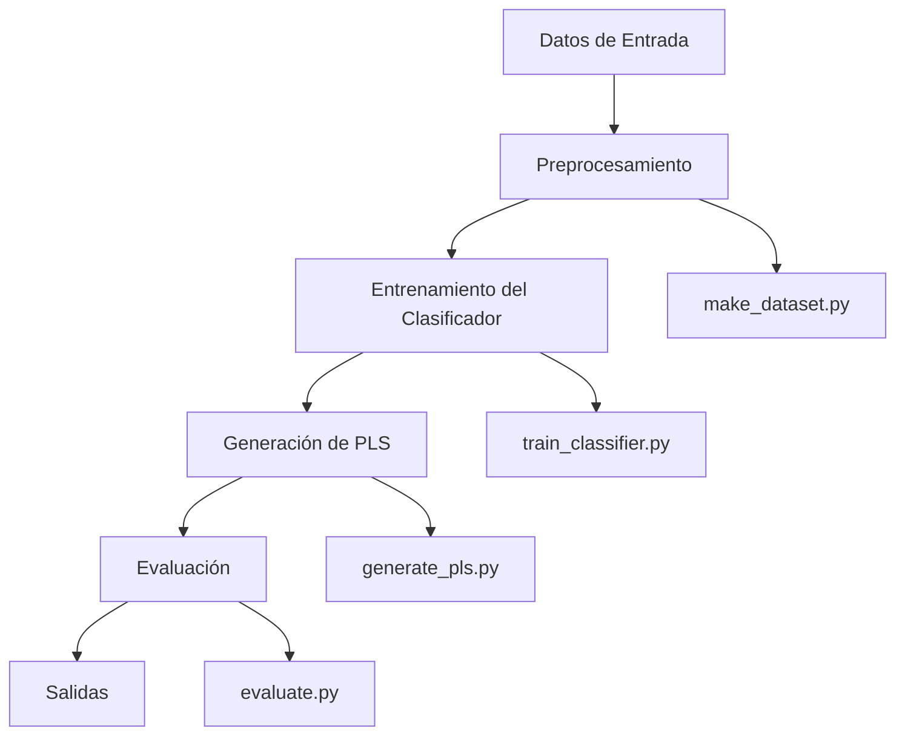

# Prototipo del Sistema

## Descripción General
Este documento describe la maqueta y el flujo del prototipo del sistema de generación de resúmenes.

## Diagrama de Flujo

## Componentes del Sistema

### 1. Preprocesamiento de Datos
- **Archivo**: `src/data/make_dataset.py`
- **Función**: Limpieza y normalización de datos de entrada

### 2. Entrenamiento del Clasificador
- **Archivo**: `src/models/train_classifier.py`
- **Función**: Entrenamiento del modelo de clasificación

### 3. Generación de PLS
- **Archivo**: `src/models/generate_pls.py`
- **Función**: Generación de resúmenes tipo PLS

### 4. Evaluación
- **Archivo**: `src/models/evaluate.py`
- **Función**: Evaluación del rendimiento del sistema

### 5. Utilidades
- **Archivo**: `src/utils/io.py`
- **Función**: Funciones auxiliares de entrada/salida

## Flujo de Trabajo

1. **Ingesta de Datos**: Los datos originales se almacenan en `data/raw/`
2. **Preprocesamiento**: Los datos se limpian y normalizan, guardándose en `data/processed/`
3. **Entrenamiento**: Se entrena el clasificador usando los datos procesados
4. **Generación**: Se generan los resúmenes PLS
5. **Evaluación**: Se evalúa el rendimiento del sistema
6. **Salidas**: Los resultados se almacenan en `data/outputs/` y `data/evaluation/`
